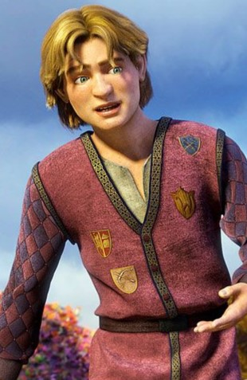
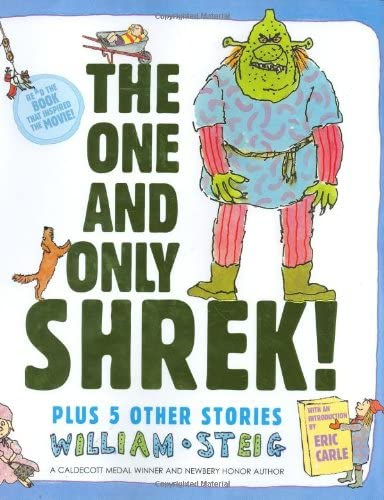

# Shrek Fan Club

*This site was created for film connoisseurs only.*

If you, for some strange reason, do not consider the movie **"Shrek"** ,to be one of the greatest cinematic masterpieces...

be gone. leave at once!

## [Shrek the Third](https://www.youtube.com/watch?v=_MoIr7811Bs&ab_channel=RottenTomatoesClassicTrailers "trailer") (2007) [^1]

In the plot, Prince Charming is plotting to overthrow Shrek and Fiona, who have inherited the throne following King Harold's death. Shrek, who does not want to rule the kingdom and does not believe an ogre is fit to be king, attempts to convince Fiona's underachieving, 16-year-old cousin Artie to reign instead.

Artie:

### *Fun fact*
Did you know that the ***Shrek*** *Film Series* is loosely based on the 1990 picture book **[Shrek!](https://en.wikipedia.org/wiki/Shrek! "wiki will tell u all ab it")**

|Shrek|Donkey|Lord Farquaad|
|:---:|:---:|:---:|

[^1]:(It's my fav one)
